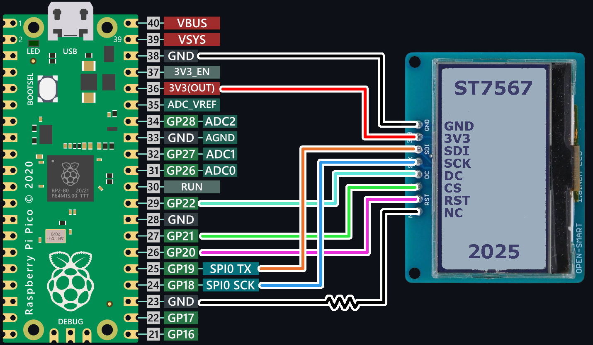

# ST7567 driver for the RPi Pico (RP2040)
This driver allows you to control an LCD using SPI with the RP2040 MCU.
It includes functions for initializing the display and drawing graphics using a framebuffer.


## Features
- Clearable and easily writable Framebuffer 
- Drawing shape functions for lines, rectangles, circles and individual pixels
- Drawing various fonts (To be done)
- Displaying bitmap images
- PWM dimmable backlight

## Wiring Diagram



| Pico Pin | Display Pin  |
| :------: |:----:|
| 3V3(OUT) | 3V3 |
| GND | GND |
| SPI TX | SDI |
| SPI SCK | SCK |
| Any GPIO | DC |
| Any GPIO | CS |
| Any GPIO | RST |
| GND | NC/LED |

Connect NC/LED pin to GND to enable backlight.

For PWM dimming use a transistor/MOSFET, connecting base to any GPIO, Collector/Emitter to GND and NC/LED.

## Usage

### Built-in examples
1. Make sure you have [pico SDK](https://github.com/raspberrypi/pico-sdk) installed and working on your machine
2. Clone this repo 
3. Set your `PICO_SDK_PATH`
4. Choose an example by uncommenting only 1 example in CMakeLists.txt
5. build and compile using

    ```
    mkdir build
    cd build
    cmake ..
    make
    ```

3. Flash the ST7567_example.uf2 located in the same directory. 

### Integrating into your codebase
1. Clone this repo inside your project

2. modify your CMakeLists.txt 
add the library directory using
    ``` 
    add_subdirectory(ST7567-C-driver-for-RP2040)
    ```
    and add ST7567_driver to target_link_libraries

3. include header in your .c file
    ```
    #include "ST7567.h"
    ```

4. Properly use the library, check examples/ to see how
