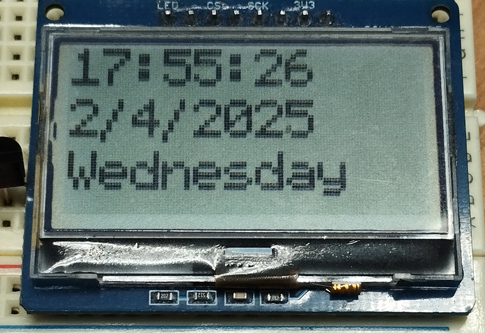

# ST7567 driver for RPi Pico (RP2040)
This RP2040 driver allows you to control ST7567 LCD using SPI. Made to quickly show functionality of the display or be [integrated as a library to your project](#integrating-into-your-codebase). Uses permissive MIT License

> Keep in mind that this driver may not be stable and does not have all features, it is still in development

# Features
- Clearable and easily writable framebuffer 
- Drawing various graphics
- Drawing built-in or custom bitmap fonts
- Displaying bitmap images
- PWM dimmable backlight

# Showcase


###### This GIF is [showcase.c](examples/showcase.c) example code  



###### This is [digital_clock.c](examples/digital_clock.c) example code

# Wiring Diagram

  

> This diagram shows the default wiring for examples

| Pico (Custom) | Pico (Default) | Display|
| :------------:|:--------------:|:-------:|
| GND           | GND            | GND     |
| 3V3(OUT)      | 3V3(OUT)       | 3V3     |
| Any SPI TX    | GPIO 19        | SDI     |
| Any SPI SCK   | GPIO 18        | SCK     |
| Any GPIO      | GPIO 22        | DC      |
| Any GPIO      | GPIO 21        | CS      |
| Any GPIO      | GPIO 20        | RST     |
| [See Below](#for-fixed-backlighting)     | GND | LED |  

> Ensure you are using correct SPI pins for the corresponding SPI instace (SPI0 / SPI1)

For example code you can edit pinout globaly in [pinout.h](examples/pinout.h).

##### For fixed backlighting:  
- Connect a resistor from `LED` to `GND`  

#### For software controlled backlighting (PWM):  
- You will need a transistor/MOSFET  
- Connect `LED` pin to `Emitter`  
- Connect MCU `GND` to `Collector`  
- Connect `Base` to the GPIO you provided in the code  
- Use `lcd_enable_pwm_brightness` and `lcd_set_brightness` functions

> [!NOTE]  
> If your board has `NC` pin where `LED` pin should be instead, it might not have LED backlight at all. In that case, you probably shouldn't connect it 

# Usage

## Built-in example code
1. Make sure you have [pico SDK](https://github.com/raspberrypi/pico-sdk) installed and working on your machine
2. `git clone` this repo and set `PICO_SDK_PATH` in it
3. Build using

    ```
    mkdir build
    cd build
    cmake .. -DBUILD_EXAMPLE="bare_minimum"
    ```

4. Compile using `make` in build/
5. Flash the `ST7567_example.uf2` in build/ 

6. To build different example code simply:  
    Run `cmake .. -DBUILD_EXAMPLE=<example_name>`  
    Repeat steps 4. and 5.

## Integrating into your codebase
1. `git clone` this repo inside your project

2. modify your CMakeLists.txt 

    add the library directory using
    ``` 
    add_subdirectory(ST7567-C-driver-for-RP2040)
    ```
    add `ST7567` keyword to target_link_libraries

3. include header in your .c file
    ```
    #include "ST7567.h"
    ```

4. Properly use the library, check `examples` folder for [API reference](examples/README.md) and driver usage.
